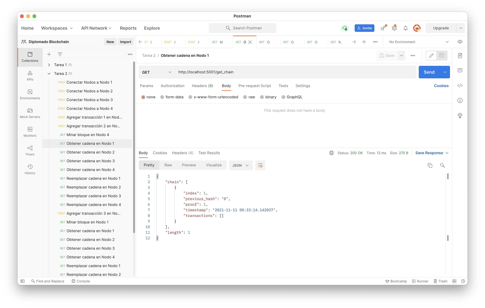
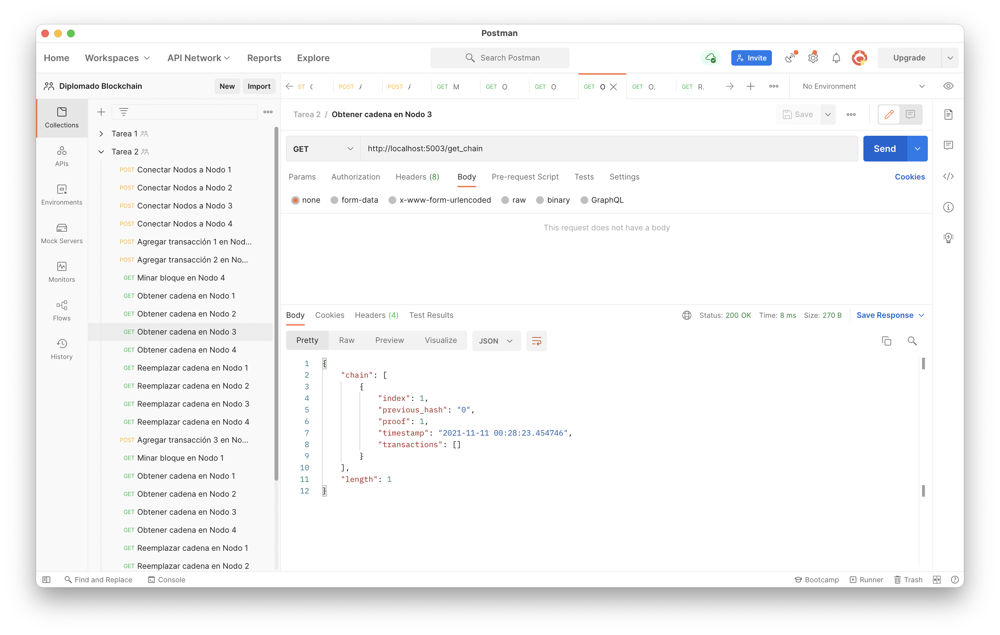
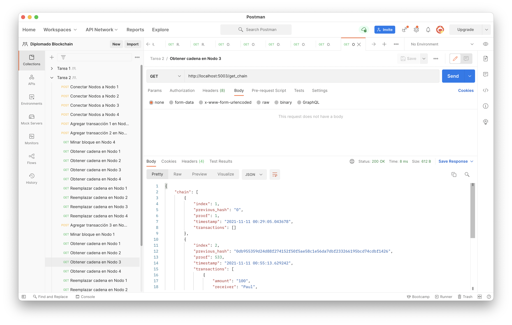
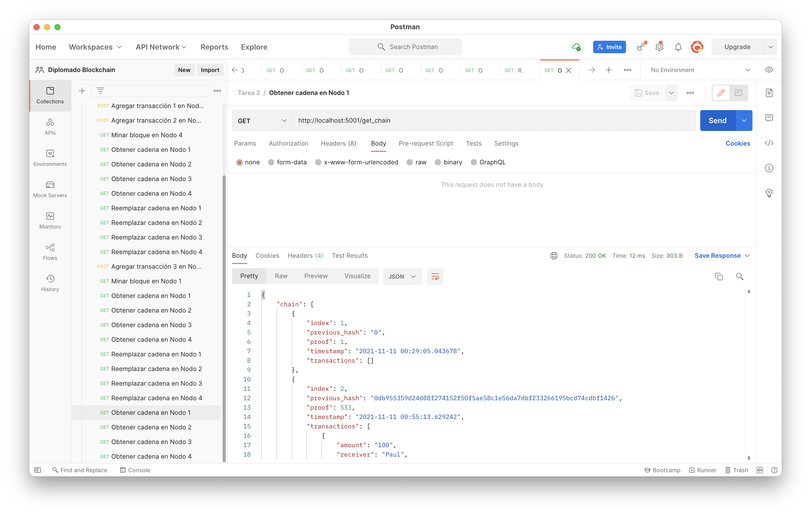
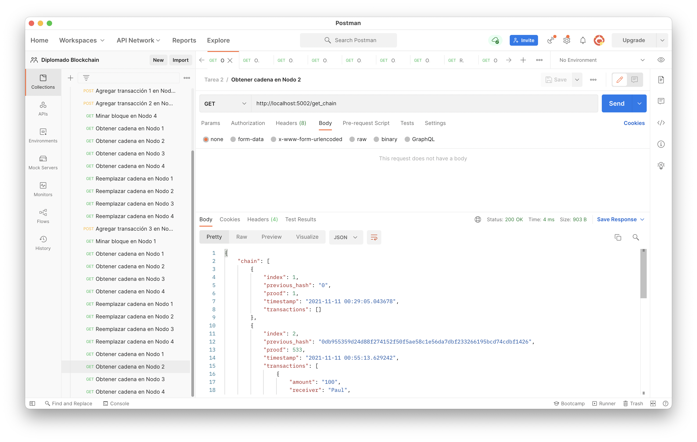
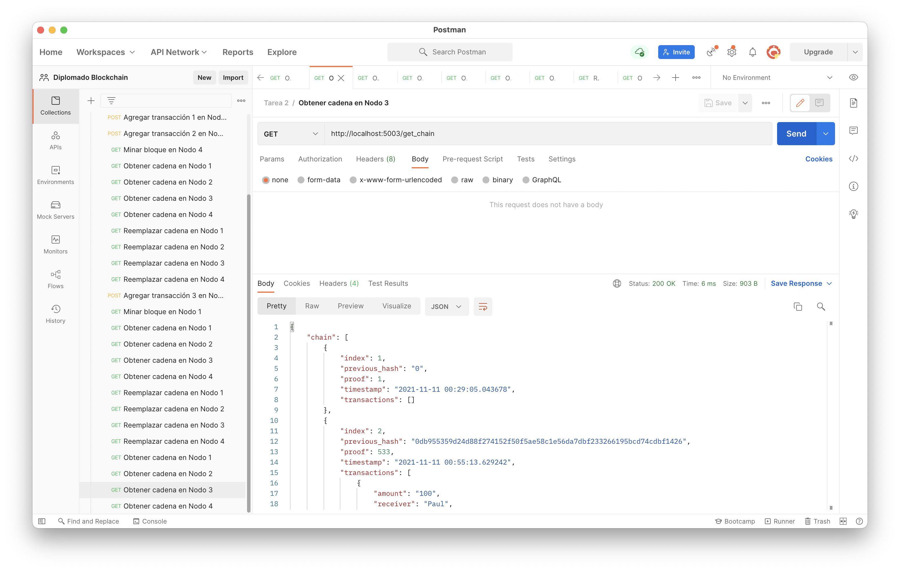
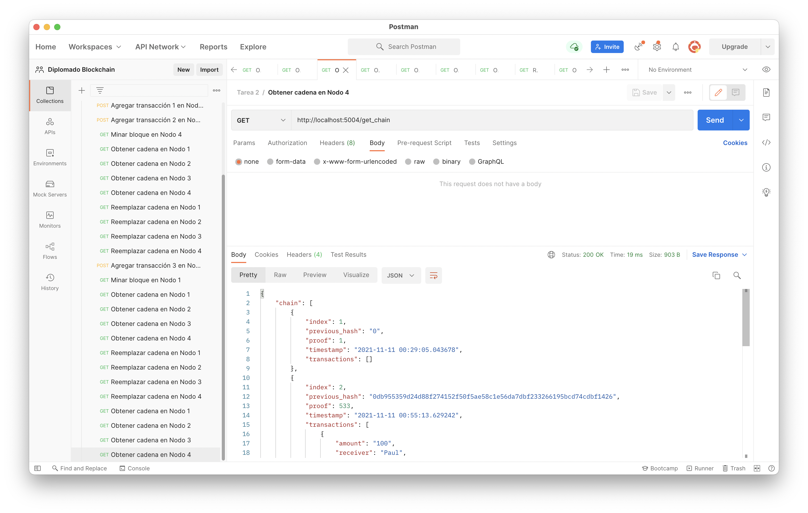

# Tarea 2 - Diplomado Blockchain

## Pasos para crear ambiente virtual
```bash
python3 -m venv venv --clear 
source venv/bin/activate
pip install --upgrade pip  
```

## Pasos para ejecutar el ejercicio

- Instalar dependencias Python 3

```bash
pip install -r requirements.txt
```

- Lanzar Flask (en modo Servidor de Desarrollo), en terminales distintos para cada servidor

```bash
FLASK_DEBUG=true python server1.py
```

```bash
FLASK_DEBUG=true python server2.py
```

```bash
FLASK_DEBUG=true python server3.py
```

```bash
FLASK_DEBUG=true python server4.py
```

## Pasos para probar el ejercicio desde terminal

- Lanzar las peticiones solicitadas, en nuevo terminal
```bash
source venv/bin/activate
source test.rest
```

## Pasos para probar el ejercicio desde Postman

- Importar en Postman:
    <a href="Tarea2.postman_collection.json">Colección Postman</a>

- Conectar los 4 nodos.

- Ejecutar 2 transacciones y un minado de bloque en Nodo 4.
- Obtener cadenas de los 4 nodos:
    
    
    
    
    
- Reemplazar la cadena en los 4 nodos.
- Ejecutar 1 transacción y un minado de bloque en Nodo 1.
- Obtener cadenas de los 4 nodos:
    
    
    
    
    
- Reemplazar la cadena en los 4 nodos.
- Obtener cadenas de los 4 nodos:
    
    
    
    
